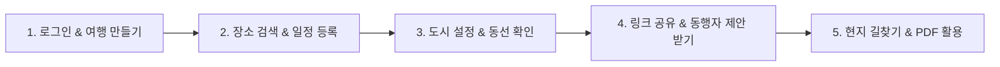

# 🧭 Triptic(트립틱) 유저 가이드

> **"직관적인 나만의 여행 일정 관리, Triptic"**
> 복잡한 계획은 덜어내고, 여행의 설렘만 남기세요. Triptic은 감성적인 인터페이스와 강력한 지도 연동 기능으로 누구나 쉽고 직관적으로 여행 일정을 계획하고 동행자와 공유할 수 있는 스마트 여행 플래너입니다.

**🔗 바로 시작하기: [https://triptic.my](https://triptic.my)**

---

## 🌟 Triptic 핵심 특장점

### 1. 🔗 실시간 동행자 링크 공유 & 장소 제안
- **동행자는 로그인 불필요**: 공유 링크(`https://triptic.my/?id=...`)만 전달하면, 동행자는 앱 설치나 로그인 없이도 브라우저에서 바로 일정을 확인할 수 있습니다.
- **자동 동기화**: 작성자가 일정을 수정하면 동행자 화면에도 곧 반영됩니다.
- **💡 동행자 장소 제안**: 동행자가 가고 싶은 곳을 검색해 며칠차에 가고 싶은지 메모와 함께 제안하면, 작성자는 상단 **[제안]** 뱃지를 확인하고 클릭 한 번으로 자신의 일정표에 등록할 수 있습니다.

### 2. 🗺️ 구글 지도 기반 동선 시각화 & 현재 위치
- **구글 플레이스 연동**: 정확한 위치, 주소, 운영 정보를 검색해 바로 일정에 추가할 수 있습니다.
- **경로 모드**: 방문 순서대로 지도 위에 넘버링 마커와 이동 선이 그려집니다. **모바일에서 지도 화면으로 전환하면 편집 모드에서도 경로가 항상 함께 표시**됩니다.
- **📍 현재 위치 버튼**: 지도 우측 하단 버튼(줌 컨트롤 옆)을 누르면 내 현재 위치로 지도가 바로 이동하고 파란 점으로 표시됩니다 (브라우저 위치 권한 필요).
- **원클릭 구글 지도 연결**: 일정표의 장소를 누르면 구글 지도 앱/웹 길찾기로 바로 연결됩니다.

### 3. 🏙️ 일차별 활동 도시 자유 설정
- 오사카 3일 + 교토 2일처럼 여러 도시를 넘나드는 다구간 여행도 완벽하게 지원합니다.
- 일차 탭 아래 도시 표시 바의 **[도시 변경]** 버튼으로 해당 일차부터 여행 끝까지 일괄 적용할 수 있습니다.
- 도시를 바꾸면 지도 중심과 장소 검색 우선순위가 새 도시로 자동 이동합니다.

### 4. 🤖 AI 주변 명소 & 맛집 추천
- 일정에 등록한 장소를 기준으로 근처 맛집·카페·숙소·명소를 AI가 추천합니다.
- 여러 AI 엔진을 순서대로 시도하고, 모두 실패해도 자체 큐레이션 데이터로 항상 결과를 보여줍니다 — 추천이 아예 안 뜨는 일은 없습니다.
- 추천 카드에서 바로 시간을 지정해 일정에 담을 수 있습니다.

### 5. ✈️ 항공편 자동 조회
- 편명(예: `OZ102`)과 날짜만 입력하면 출발/도착 공항과 시간이 자동으로 채워집니다.
- 자동 조회가 안 되는 경우 직접 입력 폼으로 전환됩니다.

### 6. 📄 고화질 PDF 일정표
- 모든 일정, 메모, 숙소 정보가 정돈된 A4 규격 PDF를 다운로드하거나 인쇄할 수 있습니다. 인터넷이 안 되는 현지에서도 유용합니다.

### 7. ☁️ 클라우드 자동 동기화
- Google 또는 Kakao로 로그인하면 모든 여행이 자동으로 클라우드에 저장되고, 다른 기기에서 같은 계정으로 로그인하면 그대로 이어집니다.
- 파일 백업이 필요하면 하단 **[기기 동기화 & 백업]** 메뉴에서 JSON 파일로 내보내기/가져오기도 가능합니다.

---

## 📖 단계별 사용 가이드

### STEP 1. 로그인하고 여행 만들기
1. `triptic.my` 접속 시 로그인 화면이 자동으로 뜹니다.
2. 둘러만 보고 싶다면 하단의 **[로그인 없이 샘플 여행 둘러보기]** 를 눌러 예시 일정(도쿄 3박 4일)을 바로 체험할 수 있습니다.
3. 나만의 여행을 만들려면 **Google** 또는 **Kakao**로 로그인합니다.
4. 로비 화면에서 **[＋ 새 여행 만들기]** → 여행 제목, 대표 도시, 시작일/종료일, 기본 통화를 입력하고 생성하면 여행 기간만큼 일차 탭이 자동으로 만들어집니다.

### STEP 2. 장소 검색 및 일정 구성
1. 검색창에 장소명이나 주소를 입력하고 자동완성 목록에서 선택한 뒤 **[추가]** 를 누릅니다.
2. 카드를 길게 눌러 드래그하면 방문 순서를 바꿀 수 있고, 위/아래 화살표로도 조정할 수 있습니다.
3. 시간을 지정하고, 메모 칸에 팁이나 주의사항을 적어둘 수 있습니다.
4. 카드 우측의 **[AI 추천]** 버튼으로 그 장소 주변 추천을 바로 받아볼 수 있습니다.

### STEP 3. 일차별 도시 변경 (다구간 여행)
1. 도시를 바꾸는 날의 탭을 선택합니다.
2. 일차 탭 아래 **`📍 [도시명] (N일차 방문 도시) [도시 변경]`** 바를 클릭합니다.
3. 새 도시를 검색해 선택하고, 적용 범위(이 날만 / 이 날부터 끝까지)를 골라 적용합니다.

### STEP 4. 경로 모드로 동선 확인 & 현재 위치
1. 상단 탭에서 **[경로 모드]** 를 선택하면 지도에 방문 순서대로 경로가 그려집니다.
2. 모바일에서는 편집 모드 상태로 하단 **[지도 보기]** 버튼을 눌러도 경로가 함께 표시됩니다.
3. 지도 우측 하단의 **📍 현재 위치** 버튼으로 내 위치를 바로 확인할 수 있습니다.

### STEP 5. 동행자에게 링크 공유 & 제안 받기
1. 상단 **[공유]** 버튼을 누르면 보기 전용 공유 링크가 생성됩니다.
2. 링크를 복사해 동행자에게 전달합니다. 동행자는 로그인 없이 바로 일정을 확인할 수 있습니다.
3. 동행자가 **[장소 추가 건의하기]** 로 제안을 보내면, 작성자 화면에 제안 뱃지가 뜨고 **[받은 제안 목록]** 에서 확인 후 **[일정에 추가]** 로 바로 반영할 수 있습니다.
4. 공유를 그만하고 싶으면 같은 메뉴에서 **[공유 중단]** 을 누르면 됩니다.

### STEP 6. 내보내기 & 백업
1. 상단 **[내보내기]** → **[PDF 다운로드]** 로 인쇄용 일정표를 받을 수 있습니다.
2. 하단 **[기기 동기화 & 백업]** 에서 전체 여행을 JSON 파일로 내보내거나 불러올 수 있습니다. 불러올 때 이름이 겹치면 덮어쓸지 둘 다 보관할지 선택할 수 있습니다.

---

## ❓ 자주 묻는 질문 (FAQ)

**Q. 동행자도 회원가입을 해야 일정을 볼 수 있나요?**
> 아닙니다. 동행자는 로그인·회원가입 없이 공유 링크만 열면 실시간으로 일정을 확인하고 장소를 제안할 수 있습니다.

**Q. 샘플 여행은 무엇인가요?**
> 로그인 전에도 Triptic의 화면 구성과 기능을 바로 체험해볼 수 있도록 준비된 예시 일정입니다. 샘플 여행은 공유·제안 기능이 비활성화되어 있으며, 로그인 후 **[＋ 새 여행 만들기]** 로 나만의 여행을 시작하면 모든 기능이 열립니다.

**Q. 현지에서 인터넷이 안 터져도 일정을 볼 수 있나요?**
> 네. 한 번 열어본 일정은 오프라인에서도 열람할 수 있도록 저장됩니다(PWA). 출발 전 **[PDF 내보내기]** 로 저장해 두면 더 안전합니다.

**Q. 다른 기기에서도 같은 일정을 보고 싶어요.**
> Google 또는 Kakao 계정으로 로그인하면 모든 기기에서 자동으로 동기화됩니다. 별도의 백업 코드 없이 같은 계정으로 로그인만 하면 됩니다.

**Q. AI 추천이 가끔 좀 느려요.**
> 추천은 여러 AI 엔진을 순서대로 시도한 뒤에도 응답이 없으면 자체 큐레이션 데이터로 대체합니다. 드물게 몇 초 더 걸릴 수 있지만, 추천 자체가 안 뜨는 경우는 없습니다.

**Q. 현재 위치 버튼을 눌러도 반응이 없어요.**
> 브라우저가 위치 정보 접근을 차단했을 가능성이 있습니다. 브라우저 주소창 옆 자물쇠 아이콘 → 사이트 설정에서 위치 권한을 "허용"으로 바꾼 뒤 새로고침해 주세요.

---

## 📜 개인정보처리방침 & 이용약관
- [개인정보처리방침](https://triptic.my/privacy.html)
- [이용약관](https://triptic.my/terms.html)
