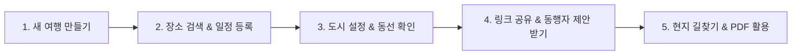

# 🧭 Triptic(트립틱) 유저 가이드

> **"직관적인 나만의 여행 일정 관리, Triptic"**  
> 복잡한 계획은 덜어내고, 여행의 설렘만 남기세요. Triptic은 감성적인 인터페이스와 강력한 지도 연동 기능으로 누구나 쉽고 직관적으로 여행 일정을 계획하고 동행자와 공유할 수 있는 스마트 여행 플래너입니다.

---

## 🌟 Triptic 핵심 특장점

### 1. 🔗 실시간 동행자 링크 공유 & 장소 제안 (실시간 협업)
- **로그인 없이 링크 하나로 끝**: 동행자에게 링크(`https://triptic.run/?id=...`)만 전달하면, 동행자는 별도의 앱 설치나 로그인 없이도 웹 브라우저에서 실시간으로 일정을 확인할 수 있습니다.
- **실시간 자동 동기화**: 플래너 작성자가 일정을 수정하거나 장소를 바꾸면, 동행자의 화면에도 즉시 반영됩니다.
- **💡 동행자 장소 제안 기능**:
  - 동행자가 가고 싶은 맛집, 카페, 관광지를 직접 검색하여 몇 일차에 가고 싶은지 메모와 함께 제안할 수 있습니다.
  - 작성자는 상단 **[제안]** 알림을 확인하고, 마음에 드는 장소를 클릭 한 번으로 내 일정표에 바로 등록할 수 있습니다.

### 2. 🗺️ 구글 맵스(Google Maps) 기반 정밀 길찾기 & 동선 시각화
- **공식 구글 플레이스 연동**: 전 세계 수억 개의 최신 장소 데이터베이스를 기반으로 정확한 위치, 영문/현지어 주소, 운영 정보를 검색할 수 있습니다.
- **스마트 경로 모드 (동선 낭비 제로)**:
  - 1일차부터 마지막 날까지 방문 순서대로 지도 위에 넘버링 마커와 이동 선(Polyline)이 깔끔하게 그려집니다.
  - 장소 간 실제 이동 거리(km)와 권장 이동 수단이 계산되어 동선 낭비를 미리 방지할 수 있습니다.
- **원클릭 구글 지도 길찾기 연동**:
  - 일정표에서 장소를 누르면 스마트폰의 구글 지도 앱 또는 웹 길찾기로 즉시 연결되어, 현지에서 헤매지 않고 목적지까지 바로 이동할 수 있습니다.

### 3. 🏙️ 일차별 활동 도시 자유 설정 (오사카 3일 + 교토 2일 등)
- 7박 8일 일본 여행 중 1~3일차는 오사카, 4~8일차는 교토에 머무는 다구간 여행도 완벽하게 지원합니다.
- 탭 아래의 **[도시 변경]** 버튼을 통해 `이 날부터 여행 끝까지 일괄 적용`을 선택하면 단 한 번의 터치로 도시가 변경됩니다.
- 도시를 바꾸면 지도 시점과 장소 검색 우선순위가 해당 도시 중심(예: 교토역)으로 자동 이동합니다.

### 4. 🤖 스마트 AI 로컬 명소 & 맛집 추천
- 현재 머무는 도시와 여행 스타일에 맞춘 현지 핫플레이스를 AI 엔진이 스마트하게 추천해 줍니다.
- 복잡한 고민 없이 추천 장소 목록에서 마음에 드는 곳을 누르면 내 일정표에 바로 담깁니다.

### 5. 📄 고화질 여행 일정표 PDF 내보내기 & 인쇄
- 오프라인 여행지나 배터리가 부족한 상황에서도 걱정 없도록, 모든 일정과 메모, 숙소 정보가 깔끔하게 정돈된 고화질 PDF 일정표를 다운로드하거나 인쇄할 수 있습니다.

### 6. ☁️ 클라우드 동기화 & 6자리 백업 코드
- Google, Kakao 소셜 간편 로그인으로 모든 기기에서 안전하게 보관됩니다.
- 비로그인 상태로 작성했더라도 **[기기 동기화 & 백업]** 메뉴에서 6자리 코드로 언제든 다른 휴대폰이나 PC로 일정을 그대로 전송할 수 있습니다.

---

## 📖 단계별 상세 사용 가이드

### STEP 1. 새 여행 만들기
1. Triptic 첫 화면에서 **[＋ 새 여행 만들기]** 버튼을 클릭합니다. *(비로그인 상태인 경우 Google/Kakao 로그인이 진행됩니다.)*
2. **여행 제목, 대표 도시, 여행 시작일 및 종료일, 기본 통화(KRW, JPY, USD 등)** 를 입력합니다.
3. [생성하기]를 누르면 여행 기간에 맞추어 1일차부터 마지막 날까지 탭이 자동 생성됩니다.

---

### STEP 2. 장소 검색 및 일정 구성
1. 상단 검색창에 방문하고 싶은 장소명이나 주소를 입력합니다. (예: `도쿄 타워`, `이치란 라멘 시부야`)
2. 자동완성 목록에서 원하는 장소를 선택한 뒤 **[추가]** 를 누르면 해당 일차 일정표에 등록됩니다.
3. **순서 변경 (드래그 앤 드롭)**:
   - 마우스나 손가락으로 장소 카드를 꾹 누른 채 위아래로 끌어당겨 방문 순서를 자유롭게 조정할 수 있습니다.
4. **시간 & 메모 기록**:
   - 예상 방문 시간(예: `14:00`), 체류 시간, 꼭 먹어야 할 메뉴나 주의사항을 메모 카드에 적어둘 수 있습니다.

---

### STEP 3. 일차별 도시 변경 (다구간 여행)
1. 일정을 작성하다가 다른 도시로 이동하는 날(예: 4일차) 탭을 클릭합니다.
2. 일차 탭 바로 아래 위치한 **`📍 [오사카] (4일차 활동 도시) [도시 변경]`** 바를 클릭합니다.
3. 검색창에 새로운 도시(예: `Kyoto, Japan`)를 입력하거나 기존 도시 칩을 선택합니다.
4. 적용 범위에서 **`🔘 이 날부터 여행 끝까지 (${day}일차~${end}일차 일괄 적용)`** 을 선택하고 [적용하기]를 누릅니다.
5. 이후 일정의 기본 도시가 자동으로 변경되며, 지도가 교토 중심으로 부드럽게 이동합니다.

---

### STEP 4. 경로 모드로 동선 및 이동 경로 확인
1. 상단 모드 전환 탭에서 **[경로 모드]** 를 클릭합니다.
2. 지도상에 등록된 스팟들이 선으로 이어지며 하루 이동 동선이 한눈에 파악됩니다.
3. 각 장소 카드의 **[길찾기]** 버튼을 누르면 구글 맵스(Google Maps)로 즉시 연결되어 도보/대중교통 최적 경로를 안내받을 수 있습니다.

---

### STEP 5. 동행자에게 링크 공유 & 장소 제안 받기
1. 상단 네비게이션 바의 **[공유]** 버튼을 클릭합니다.
2. 생성된 고유 공유 링크를 복사하여 카카오톡이나 메시지로 친구/가족에게 전송합니다.
3. **동행자 시점**:
   - 링크를 열면 깔끔한 보기 전용 플래너가 열립니다.
   - 동행자가 가고 싶은 장소를 검색하여 **`[제안 보내기]`** 를 누르면 작성자에게 전달됩니다.
4. **작성자 시점**:
   - 상단 **[제안 N건]** 뱃지가 활성화됩니다.
   - 제안함을 열어 동행자가 보낸 장소와 코멘트를 확인하고, **[일정에 추가]** 를 누르면 내 일정표에 즉시 반영됩니다.

---

### STEP 6. PDF 일정표 내보내기 & 백업
1. 상단의 **[내보내기]** 버튼을 클릭합니다.
2. **[📄 여행 일정표 PDF 내보내기]** 를 선택하면 깔끔한 고화질 A4 규격 여행 일정표가 즉시 생성됩니다.
3. 기기를 변경하거나 오프라인 백업이 필요할 때는 **[기기 동기화 & 백업]** 을 통해 6자리 코드를 발급받아 다른 브라우저에서 그대로 불러올 수 있습니다.

---

## ❓ 자주 묻는 질문 (FAQ)

**Q. 동행자도 앱에 회원가입을 해야 일정을 볼 수 있나요?**  
> **아닙니다!** 동행자는 로그인이나 회원가입을 전혀 하지 않아도 공유받은 링크만 브라우저로 열면 실시간 일정을 확인하고 새로운 장소를 제안할 수 있습니다.

**Q. 샘플 여행(도쿄 3박 4일)은 무엇인가요?**  
> 로그인하지 않고 처음 방문한 분들도 Triptic의 감성적인 동선 시각화와 일정표 구조를 바로 체험해보실 수 있도록 준비된 예시 데이터입니다. 샘플 여행은 미리보기 전용이므로 공유/제안 기능이 비활성화되어 있으며, 로그인 후 **[＋ 새 여행 만들기]** 로 나만의 여행을 시작하시면 모든 기능이 활성화됩니다.

**Q. 현지에서 인터넷이 잘 안 터져도 일정을 볼 수 있나요?**  
> 여행 출발 전 **[내보내기] > [PDF 내보내기]** 기능을 통해 스마트폰에 PDF 파일로 저장해두시면, 데이터가 터지지 않는 비행기나 지하에서도 언제든지 일정을 확인할 수 있습니다.

**Q. 다른 기기(PC에서 모바일로) 일정을 옮기고 싶어요.**  
> 구글 또는 카카오 계정으로 로그인하시면 모든 기기에서 클라우드로 자동 동기화됩니다. 또는 메인 화면 하단의 **[기기 동기화 & 백업]** 에서 간편 코드를 발급받아 옮기실 수도 있습니다.
