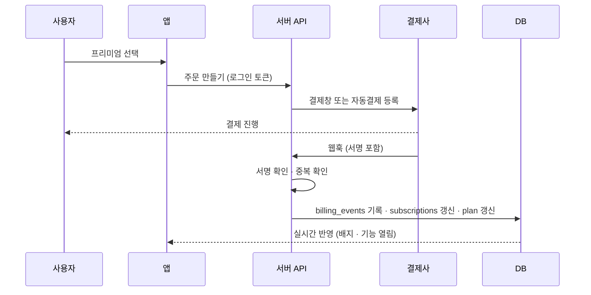

# Triptic 구독·성장 보고서

> 내부 보고서 · 2026-09-30 · 기준 커밋 `b5d40f1`
> 범위: 앱 코드 · 서버 API · DB 스키마 · 운영 DB 집계 · 운영 사이트 측정
> 작성: Claude (Claude Code)

프리미엄 구독을 어떻게 설계할지, 지금 기능에서 무엇을 고치고 무엇을 더할지, 결제를 붙이기 전에 막아야 할 보안 위험이 무엇인지 정리했습니다. 진행 기록은 [HISTORY.md](../HISTORY.md)에 있습니다.

## 목차

- [요약](#요약)
- [1. 현재 상태](#1-현재-상태)
- [2. 기능 분석과 개선점](#2-기능-분석과-개선점)
- [3. 구독제 설계](#3-구독제-설계)
- [4. 회원을 늘릴 기능](#4-회원을-늘릴-기능)
- [5. 보안 점검](#5-보안-점검)
- [6. 실행 순서](#6-실행-순서)
- [부록. 조사 방법과 한계](#부록-조사-방법과-한계)

---

## 요약

1. **결제보다 측정을 먼저 붙여야 합니다.** 운영 DB 기준 가입자 7명, 여행 3개, 저장된 예약 서류 0건, 공유로 함께 편집하는 멤버 0명입니다. 운영 환경에 분석(PostHog)과 오류 수집(Sentry) 키가 없어서 누가 어디서 이탈하는지 알 수 없습니다. 개발 계획서 §13의 원칙대로 가격과 과금 방식은 측정한 데이터로 정하는 게 맞습니다.
2. **요금 구조는 "무료 + 여행 패스 + 프리미엄 구독" 혼합형을 권합니다.** 여행 앱은 1년에 몇 번 몰아서 쓰고, 비용(서류 인식·AI·지도)도 여행 단위로 생깁니다. 필요한 순간에 한 번 결제하는 여행 패스와, 자주 떠나는 사람을 위한 연간 구독을 같이 둡니다. 계획서 §13이 기울어 있던 방향과 같습니다.
3. **공유·동행·커뮤니티는 무료로 두고, 비용이 드는 기능에 한도를 둡니다.** 초대받은 사람이 가입하는 경로가 성장의 통로라서 막으면 안 됩니다. 유료 가치는 서류 자동 인식, AI 일정·추천, 저장 용량, 오프라인, 알림, 광고 제거에 둡니다.
4. **지금 운영 중인 문제 두 가지가 새 기능보다 급합니다.** 무료 사용자 "평생 여행 2개" 한도가 서버에서 켜져 있는데 결제 수단이 없어 한도에 닿으면 더 이상 방법이 없습니다. 닉네임은 한글 2~7자만 허용돼서 영어·일본어·번체 사용자는 이름을 바꿀 수 없습니다.
5. **데이터가 새는 치명적 취약점은 찾지 못했고, 가장 큰 위험은 비용 남용입니다.** 로그인 없이 부를 수 있는 AI API, 누구나 쓸 수 있는 이메일 가입 여부 확인, 공개된 GitHub 저장소를 결제 도입 전에 정리해야 합니다. 권한 컬럼 보호와 관리자 함수의 권한 확인은 잘 되어 있습니다.
6. **회원을 늘릴 기능은 "가입 전 체험 · AI 일정 초안 · 예약 메일 전달 인식" 순서를 권합니다.** 셋 다 이미 있는 부품(샘플 여행, DeepSeek 파이프라인, 서류 인식 파이프라인)을 다시 쓰므로 새로 만드는 양에 비해 효과가 큽니다.

---

## 1. 현재 상태

### 운영 데이터

2026-09-30 운영 DB 읽기 전용 집계입니다. 개인을 알아볼 수 있는 값은 조회하지 않았습니다.

| 항목 | 값 |
|---|---|
| 가입자 | 7명 (모두 최근 30일) |
| 최근 7일 로그인 | 6명 |
| 로그인 방식 | 카카오 5 · 구글 2 |
| 요금제가 pro인 계정 | 5개 |
| 여행 | 3개 (일정 항목 22개) |
| 저장된 예약 서류 | 0건 (인식 요청 기록 5건) |
| 공유로 들어온 편집 멤버 | 0명 |
| 커뮤니티 글 · 동행 모집 글 | 3 · 5 |

> **해석.** 출시 초기라 전환율이나 재방문율을 말할 수 있는 규모가 아닙니다. 이 보고서의 가격과 한도 숫자는 모두 **가설**이고, 측정으로 확인해야 합니다. pro 계정 5개는 관리 화면에서 직접 바꾼 테스트·지인 계정으로 보입니다. 유료 출시 전에 정리해야 합니다.

### 기능 지도

| 영역 | 지금 있는 기능 |
|---|---|
| 여행 계획 | 여행 만들기(구글 장소 검색), 일자별 일정과 끌어서 순서 바꾸기, 지도 동선과 이동 시간, 숙소·식사·항공편, 다통화 경비와 환율, 날씨, 출발 체크리스트, PDF 내보내기, 일정 완료(보기 전용)와 재편집, 샘플 여행, 기기 백업 |
| 함께 편집 | 공유 링크 → 로그인 → 편집 멤버로 참여, 실시간 동시 편집(충돌 감지), 멤버 내보내기·나가기 |
| 예약 서류 | PDF·사진 업로드 → 문자 인식(PDF 글자층 또는 Google Vision) → DeepSeek 구조화 → 검수 창 → 일정 반영, 민감정보 가림, 바우처 보관함, 하루 30건 한도 |
| AI | 주변 장소 추천(반경 장소 풀·캐시로 비용 절감), 도시 소개(언어별 영구 캐시) |
| 커뮤니티 | 여행지 채널 100곳, 글·댓글·좋아요·자동 번역, 일정 첨부와 복제, 신고·차단·자동 검열 |
| 동행 찾기 | 모집·지원·매칭, QR 대면 확인, 그룹 채팅, 경비 정산, 후기와 별점 |
| 예약 연결(수익) | 항공(마이리얼트립·Travelpayouts), 호텔(트립닷컴 위젯·배너), 액티비티(Klook·마이리얼트립), 유심·eSIM(유심사·마이리얼트립·Airalo), 애드센스 |
| 기반 | 4개 언어(첫 방문 IP로 언어 선택), PWA 오프라인, PC 비로그인 둘러보기, 검색 로봇용 페이지·사이트맵, 관리자 콘솔(회원·요금제·문의·판매), 프리미엄 배지, iOS 앱 틀(미출시) |

### 강점

- **서류가 일정이 되는 흐름.** 해외 앱(TripIt)의 핵심 기능을 한국어 예약 확인서에 맞춰 갖췄습니다. 국내 여행 플래너와 가장 크게 다른 점입니다.
- **계획, 동행 찾기, 정산이 한 앱에.** 동행을 QR로 대면 확인하고 후기까지 남기는 구조는 드뭅니다.
- **수익 통로가 이미 여럿.** 제휴 5곳과 광고가 연결돼 있어서 구독 전에도 매출이 날 수 있습니다.
- **서버에서 규칙을 지키는 구조.** 요금제·권한 컬럼은 DB 트리거로 보호되고, 한도는 화면이 아니라 DB와 서버에서 강제합니다. 결제를 붙일 때 그대로 쓸 수 있는 기반입니다.

---

## 2. 기능 분석과 개선점

우선순위는 "사용자가 지금 막히는가"와 "고치면 가입·활성화에 바로 영향이 있는가"로 정했습니다.

| 우선 | 영역 | 지금 | 문제 | 제안 |
|---|---|---|---|---|
| 즉시 | 측정 | PostHog·Sentry 코드는 있으나 운영 키 없음 | 가입 → 첫 여행 → 첫 장소 → 서류 → 공유 중 어디서 멈추는지, 오류가 나는지 모름 | 운영 키 설정, 핵심 이벤트 10개 안팎 정의, 개인정보처리방침에 분석 도구 추가 |
| 즉시 | 무료 한도 | 여행 생성 평생 2개(삭제해도 복구 안 됨), 넘으면 "한도에 도달했어요"만 표시 | 결제 수단이 없어 막다른 길. 첫 사용자가 테스트 여행 두 개 만들면 끝 | 결제 도입 전까지 "동시에 진행 중인 여행 N개"로 바꾸거나 한도를 크게 올리고, 한도 화면에 대기 명단·문의 연결 |
| 즉시 | 닉네임 | 한글 2~7자만 허용(서버 트리거와 화면 모두) | IP로 영어·일본어·번체 화면을 보여 주면서 이름은 한글만 받음. 영어 오류문도 "Korean characters" | 언어와 무관하게 문자 2~16자(숫자·일부 기호 허용), 금칙어·중복 검사는 유지 |
| 높음 | 모바일 첫 경험 | 모바일 비로그인은 로그인 화면(샘플 여행만 예외), PC는 둘러보기 가능 | 가치를 보기 전에 가입부터 요구 → 모바일 방문자가 그대로 이탈 | 게스트로 여행을 만들고 "저장"할 때 가입. 기기에 임시 저장 후 가입하면 계정으로 옮김 |
| 높음 | 활성화 | 서류 저장 0건, 공유 멤버 0명 | 가장 강한 두 기능이 거의 안 쓰임. 있다는 걸 모를 가능성 | 첫 여행 만든 직후 3단계 안내(장소 추가 · 예약 확인서 올리기 · 같이 갈 사람 초대)와 진행 표시 |
| 중간 | 알림 | 알림 설정 화면과 앱 토큰 저장까지만, 실제 발송 없음 | 여행과 여행 사이에 다시 올 이유가 없음 | 이메일 알림부터(D-7 체크리스트, D-1 날씨·서류). 앱 출시 후 푸시 |
| 중간 | 커뮤니티 초기 콘텐츠 | 글 3개, 동행 모집 5개 | 빈 게시판은 신뢰를 떨어뜨리고 재방문 이유가 없음 | 운영 계정으로 인기 여행지 일정 템플릿 20~30개를 올리고 공개 일정 페이지를 검색에 노출 |
| 중간 | iOS 앱 | Capacitor 틀, Apple 개발자 프로그램 미가입 | 앱스토어 노출·푸시·Apple 로그인 불가 | 웹에서 재방문이 확인되면 가입. 유료화 시 앱 내 결제 규정 고려(3장) |
| 낮음 | 첫 로딩 | 느린 4G·저사양 환경에서 앱 표시까지 약 4.4초(9/30 측정) | 이탈 요인. 광고 스크립트 지연·폰트·인트로는 개선 완료 | 홈 화면 코드 미리 받기(약 0.5초 기대), 실제 사용자 수치는 분석 도구로 확인 |
| 낮음 | 완료·재편집 | 여행 완료 후 재편집 무료 5회 | 사용자가 이 제한을 이해하기 어렵고 수익 기여가 작음 | 유료 한도에서 빼고, 완료는 "보관" 기능으로만 두는 것을 검토 |

---

## 3. 구독제 설계

### 원칙

- **성장 통로는 무료.** 공유 편집, 동행 찾기, 커뮤니티. 초대받은 친구가 들어오는 길을 잠그면 성장이 멈춥니다.
- **비용이 드는 기능에 한도.** 서류 인식(Vision + LLM), AI, 저장 용량. 무료는 충분히 체험할 만큼, 프리미엄은 넉넉하게 주되 남용 방지 한도는 유지합니다.
- **필요한 순간에 판매.** 결제 의향은 출발 2~4주 전에 가장 높습니다. 그래서 구독 하나만이 아니라 여행 단위 결제가 있어야 합니다.
- **안전 기능은 유료화 금지.** 신고, 차단, QR 대면 확인, 후기는 누구에게나 열어 둡니다.
- **제휴 링크는 광고가 아님.** 항공·호텔·투어 연결은 기능이자 수익원이라 프리미엄에서도 유지합니다. 없애는 것은 애드센스 광고뿐입니다.
- **만료돼도 데이터는 지킴.** 구독이 끝나도 아무것도 지우지 않습니다. 한도를 넘는 부분은 읽기만 가능하게 두고, 새로 추가하는 것만 막습니다.

### 요금 구조

| 요금제 | 가격 (가설) | 내용 |
|---|---|---|
| 무료 | ₩0 | 여행 계획 핵심 기능 전부 / 함께 편집, 동행 찾기, 커뮤니티 / 서류 인식·AI는 체험 한도 |
| 여행 패스 (일회 결제) | ₩4,900 / 여행 1개 | 그 여행 하나에 프리미엄 기능을 영구 적용 / 같이 편집하는 멤버도 그 여행 안에서 혜택 / 구독보다 구현·환불이 단순해서 먼저 출시하기 좋음 |
| 프리미엄 (구독) | 연 ₩29,000 · 월 ₩3,900 | 모든 여행에 프리미엄 기능 / 연간 결제 시 월 환산 약 ₩2,400(약 38% 할인) / Premium 배지(구현 완료) |

> **가격은 가설입니다.** 해외 여행 플래너의 유료 플랜은 대체로 연 40~50달러 수준입니다(Wanderlog Pro, TripIt Pro 등, 현재 가격은 각 사이트에서 확인 필요). 결제를 붙이기 전에 "프리미엄 알아보기" 화면과 대기 명단을 먼저 열어 클릭률과 신청률로 가격 반응을 보는 것을 권합니다.

### 무료와 프리미엄의 차이

| 기능 | 무료 | 프리미엄 · 여행 패스 | 근거 |
|---|---|---|---|
| 여행 만들기 | 진행 중인 여행 3개까지(지난 여행은 계속 열람) | 제한 없음 | 지금 "평생 2개"는 체험도 하기 전에 막힘 |
| 공유·함께 편집 | 무료, 멤버 6명까지 | 멤버 제한 없음, 보기 전용 링크 등 권한 세분화 | 성장 통로 |
| 예약 서류 자동 인식 | 월 5건 | 월 100건(하루 30건 남용 방지 유지) | 건당 Vision·LLM 비용 |
| 바우처 보관 | 총 200MB | 총 5GB | 저장 비용 |
| AI 장소 추천·도시 소개 | 하루 10회 | 사실상 무제한(남용 방지 한도) | LLM·지도 API 비용 |
| AI 일정 초안 (신규) | 여행당 1회 | 제한 없음, 다시 만들기 | 가장 강한 결제 동기가 될 기능 |
| 오프라인 | 최근 열어 본 일정 캐시 | 여행 전체와 바우처를 기기에 저장 | 해외 데이터 불안 해소 |
| 알림 (신규) | 출발 전날 이메일 | 항공편 변경·체크인·맞춤 리마인더 | 편의 |
| PDF 내보내기 | 기본(트립틱 표시) | 표시 제거, 테마 선택 | 편의 |
| 경비 | 기록, 다통화, 동행 정산 | 영수증 인식, 엑셀 내보내기 | 편의 |
| 광고 | 표시 | 제거(제휴 링크는 유지) | |
| 동행 찾기·커뮤니티 | 전부 무료 | 모집 글 상단 노출(선택) | 안전 기능은 유료화 금지 |

### 기술 설계

**지금 있는 것.** `profiles.plan`(free/pro)과 관리자가 손으로 바꾸는 함수, 모든 기능에 true를 돌려주는 `can()` 자리, 서버 한도 세 곳(여행 생성 트리거, 재편집 함수, 서류 인식 하루 30건)이 있습니다. 사용자가 자기 요금제를 직접 바꾸지 못하게 막는 트리거도 이미 있습니다.

**더할 것.** 결제 결과는 결제사 웹훅으로만 받고, 서버(서비스 역할)만 기록합니다. 앱은 읽기만 합니다.

```text
subscriptions      user_id · provider · provider_subscription_id(고유) · product(monthly/yearly)
                   status(trialing/active/past_due/canceled/expired) · current_period_end
                   cancel_at_period_end · grace_until · updated_at
trip_passes        trip_id · purchaser_id · provider · provider_payment_id(고유) · refunded_at
billing_events     provider · event_id(고유) · type · payload · received_at · processed_at
                   → 같은 웹훅이 두 번 와도 한 번만 처리, 분쟁 시 기록으로 확인

effective_plan(user)   유효한 구독 또는 유예 기간 → premium / 관리자 지정(comp) → premium / 그 외 free
trip_is_premium(trip)  소유자가 premium 이거나 그 여행에 패스가 있음
```

- **요금제 값의 출처를 나눕니다.** `plan`은 웹훅이 갱신하는 캐시로 두고 `plan_source`(subscription / pass / comp)를 둡니다. 관리자가 준 무료 프리미엄(comp)과 결제한 프리미엄이 섞이지 않습니다.
- **서버가 막는 지점.** 여행 생성 트리거, 서류 인식 API, 바우처 업로드(용량 검사), AI 추천·도시 소개 API, 새 AI 일정 API. 화면의 `can()`은 버튼 표시·안내용이고, 실제 판정은 모두 서버에서 합니다.
- **한도에 닿았을 때.** 서버가 이미 돌려주는 오류 표시(`trip_limit_reached` 등)를 받아 결제 시트를 엽니다. 지금은 문구만 뜨는 자리입니다.
- **갱신 실패와 해지.** 자동 결제 실패 시 `past_due`로 두고 3~7일 유예 후 무료로 전환합니다. 해지는 결제 기간이 끝날 때까지 유지합니다.
- **설정 화면.** 구독 상태, 다음 결제일, 해지, 영수증, 결제 수단 변경을 둡니다.



### 결제 수단

| 대상 | 후보 | 메모 |
|---|---|---|
| 국내 웹 (먼저) | 토스페이먼츠 또는 포트원 | 카드 자동결제(빌링키), 간편결제 정기결제. 가입 심사·수수료·정산 주기는 각 사 공식 안내로 확인. 사용자 대부분이 카카오 로그인이라 카카오페이 지원 여부도 확인 |
| 해외 웹 | 판매 대행형 결제 서비스(Merchant of Record, 예: Paddle) | 나라별 부가세·환불을 대신 처리. 한국 사업자 가입 가능 여부와 수수료 확인 필요 |
| iOS 앱 (출시 후) | 앱 내 결제 + 구독 관리 도구(예: RevenueCat) | 디지털 기능 잠금 해제는 원칙적으로 앱 내 결제 대상. 국가별 외부 결제 허용 규정이 바뀌어 왔으므로 출시 시점의 App Store 심사 지침 확인. 웹과 앱의 권한을 한 곳에서 합칠 방법이 필요 |

### 법·정책 확인 목록

> **아래 항목은 모두 공식 안내 또는 전문가 확인이 필요합니다.** 이 보고서는 법률 조언이 아니며, 조항·기간·수수료는 기억에 기대 적지 않았습니다.

- 통신판매업 신고, 사이트 하단 사업자 정보 표시
- 전자상거래법의 정기결제 관련 의무: 무료에서 유료로 넘어가거나 가격이 오를 때 사전 통지, 해지 방법 안내
- 디지털 콘텐츠 청약철회와 환불 규정, 이용약관의 유료 서비스 조항
- 개인정보처리방침: 결제 대행사 처리 위탁, 분석 도구 추가
- 해외 판매 시 부가세(판매 대행형을 쓰면 대행)
- iOS 앱의 결제 지침

---

## 4. 회원을 늘릴 기능

"가입(획득) → 첫 가치(활성화) → 다시 옴(유지) → 친구를 데려옴(추천)" 중 어디에 효과가 있는지와, 이미 있는 부품을 얼마나 다시 쓰는지로 순서를 정했습니다.

| 순서 | 기능 | 효과 단계 | 효과 | 난이도 | 왜 |
|---|---|---|---|---|---|
| 1 | 모바일 가입 전 체험 | 활성화 | 큼 | 중간 | 게스트로 여행을 만들고 저장할 때 가입. 샘플 여행 편집 화면이 이미 있어 확장만 하면 됨 |
| 2 | AI 일정 초안 | 획득 · 활성화 | 큼 | 중간 | "도쿄 3박 4일, 맛집 위주" → 일자별 초안과 지도 동선. DeepSeek와 장소 풀·캐시를 다시 씀. 무료 1회가 프리미엄으로 가는 계기 |
| 3 | 예약 메일 전달 자동 인식 | 활성화 · 유지 | 큼 | 중간~높음 | 전용 주소로 예약 확인 메일을 전달하면 일정에 들어감. 서류 인식 파이프라인을 그대로 쓰고, 메일 수신 서비스만 더하면 됨 |
| 4 | 초대 보상 | 추천 | 큼 | 낮음 | 공유 링크로 친구가 가입하면 양쪽에 프리미엄 기간. 공유 → 로그인 → 참여 흐름이 이미 있음 |
| 5 | 공개 일정 템플릿과 검색 노출 | 획득 | 중간 | 낮음 | 커뮤니티 일정 첨부·복제가 이미 있음. "오사카 2박 3일 일정" 같은 페이지를 검색 로봇용 페이지로 색인 |
| 6 | 여행 요약 카드 공유 | 추천 | 중간 | 낮음 | 여행이 끝나면 동선 지도, 도시, 이동 거리를 카드 이미지로 만들어 인스타·카카오톡에 공유. 통계와 세계지도가 이미 있음 |
| 7 | 카카오톡 공유 최적화 | 추천 | 중간 | 낮음 | 여행 초대 링크를 카카오 공유 카드로. 가입자 대부분이 카카오 로그인 |
| 8 | 출발 전 알림 (이메일) | 유지 | 중간 | 중간 | D-7 체크리스트, D-1 날씨와 서류, 당일 항공편. 여행 사이에 다시 오게 만듦 |
| 9 | 항공권 가격 알림 | 유지 · 수익 | 중간 | 중간 | 관심 노선이 싸지면 알림 → 제휴 링크로 연결 |
| 10 | 오프라인 여행 팩 | 프리미엄 가치 | 중간 | 높음 | 여행 전체와 바우처를 기기에 저장. 지도 오프라인은 라이선스·비용 확인 필요 |

지금 권하지 않는 것: 소셜 피드 확장, 활동 배지 같은 게임 요소. 사용자가 적을 때는 효과가 작고 관리 비용만 늘어납니다.

---

## 5. 보안 점검

DB 접근 규칙(RLS), 보호 컬럼 트리거, 관리자 함수 안의 권한 확인은 잘 되어 있습니다. 데이터가 새는 치명적 취약점은 찾지 못했습니다. 아래는 실제 영향 순서로 정리한 것이고, 공격 방법이 아니라 문제의 종류, 영향, 조치만 적었습니다.

| 심각도 | 항목 | 영향 | 조치 |
|---|---|---|---|
| 높음 | 로그인 없이 부를 수 있는 AI API | 도시 소개·장소 추천 API가 로그인 없이 호출되고, 호출 한도가 서버 인스턴스마다 따로 세어져 실효성이 낮음. 도시 소개는 처음 보는 문자열마다 LLM을 새로 부르고 결과를 영구 저장. LLM·지도 비용과 캐시 테이블이 한없이 늘 수 있음 | 도시 소개는 등록된 여행지만 새로 생성하고 나머지는 캐시 읽기만. 추천은 로그인 필수 + 사용자별 하루 한도(이미 있는 사용량 기록 재사용). 전역 호출 한도(Vercel 방화벽 규칙 등)와 LLM·Google 콘솔 예산 알림 |
| 높음 | 공개된 GitHub 저장소 | 두 저장소 모두 공개. 커밋 기록에서 비밀 키는 찾지 못함(발견된 anon 키는 원래 공개용). 하지만 서버 로직, DB 함수 이름, 내부 운영 메모가 모두 공개돼 공격 준비가 쉬워지고, 결제 코드가 들어가면 더 민감해짐 | 비공개로 전환(Vercel 배포 연결은 유지 가능). 전환 전 docs 폴더의 내부 메모 점검 |
| 중간 | 이메일 가입 여부 확인 함수 | 로그인하지 않은 누구나 특정 이메일이 가입했는지 확인 가능(계정 열거). 표적 피싱이나 비밀번호 대입의 사전 단계로 쓰일 수 있음 | 비로그인 실행 권한 회수. 가입 화면은 가입 시도 결과로 안내하거나, 호출 한도가 있는 서버 API를 거쳐 확인 |
| 중간 | 콘텐츠 보안 정책(CSP)이 보고 전용 | 스크립트 주입(XSS)을 브라우저가 실제로 막지 않음. 광고·제휴 등 외부 스크립트가 많아 더 중요 | 위반 보고를 모아 허용 목록을 맞춘 뒤 강제 모드로 전환 |
| 중간 | 유출 비밀번호 검사 꺼짐 | 이메일·비밀번호 가입이 있어서, 이미 유출된 비밀번호로 가입 가능 | Supabase 인증 설정에서 켜기(요금제 조건 확인) |
| 중간 | 안 쓰는 옛 환경변수 API | 새 앱에서 안 쓰는데 배포되어 있고 지도 키를 돌려줌. 지도 키 사용 제한이 약하면 남의 사이트에서 우리 비용으로 쓸 수 있음 | API 삭제. Google Cloud에서 지도 키의 웹사이트·API 제한 확인(이 환경에서는 확인 불가). 예전에 노출된 적 있는 Google 키의 재발급 여부 확인 |
| 중간 | 검색 경로가 고정되지 않은 DB 함수 7개 | 보호 컬럼 트리거가 포함됨. 함수가 예상과 다른 객체를 참조할 여지 | 각 함수에 `search_path` 고정 |
| 낮음 | 비로그인에게도 열린 관리자·여행 함수 실행 권한 | 함수 안에서 관리자 역할과 소유자를 확인하는 것을 확인함. 지금은 우회되지 않음 | 심층 방어로 비로그인 실행 권한 회수. 트리거 전용 함수 권한도 정리 |
| 낮음 | 오류·이상 징후 수집 없음 | 공격이나 장애가 나도 모름 | Sentry 운영 키 설정, 결제 웹훅 실패 알림 |
| 낮음 | 예약 서류 보관 기간 | 여권번호 등 민감정보가 들어갈 수 있음(가림 처리는 있음) | 여행 종료 후 보관 기간 정책과 일괄 삭제 기능, 방침에 명시 |

### 문제가 아닌 것 (의도된 설계)

- **정책 없는 RLS 테이블 6개**(AI 캐시, 제휴 링크 캐시, QR 토큰 등): 서버만 쓰도록 일부러 잠근 것입니다.
- **커뮤니티 프로필 뷰**(점검 도구가 ERROR로 표시): 공개해도 되는 열(이름, 아바타, 소개, 관리자 여부, 별점)만 내보내는 의도된 설계입니다.
- **로그인 사용자가 실행할 수 있는 함수 35개 경고**: 대부분 앱이 부르라고 만든 함수이고, 안에서 권한을 확인합니다.

> **결제 도입 전 필수.** AI API 비용 남용 차단, 이메일 확인 함수 권한 회수, 저장소 비공개 전환, 웹훅 서명 확인과 중복 처리, 요금제 컬럼은 서버만 바꾸는 규칙 유지(이미 보호됨).

---

## 6. 실행 순서

| 단계 | 기간 | 할 일 |
|---|---|---|
| 0단계 · 바로 | ~2주 | 분석·오류 수집 운영 키, 핵심 이벤트, 방침 반영 / 무료 여행 한도 완화, 닉네임 규칙 다국어화 / 보안 높음·중간 항목, 저장소 비공개 / pro 계정 정리(관리자 지정으로 표시하거나 무료로) |
| 1단계 · 가격 반응 보기 | 2~6주 | 모바일 가입 전 체험, 첫 여행 3단계 안내 / 프리미엄 소개 화면과 대기 명단 / 결제 테이블, `can()` 실제 판정, 한도 도달 화면 / AI 일정 초안(무료 1회) |
| 2단계 · 첫 결제 | 6~10주 | 국내 결제 연동, 여행 패스 먼저 / 웹훅, 구독 관리 화면, 약관·방침 개정 / 초대 보상, 출발 전 이메일 알림 |
| 3단계 · 넓히기 | 10주~ | 연간 구독, 해외 결제 / 예약 메일 전달 인식 / iOS 출시와 앱 내 결제 |

> **판단 시점.** 1단계가 끝나면 활성 사용자 수, 30일 재방문율, 프리미엄 화면 클릭률과 대기 명단 신청률을 보고 구독과 여행 패스 중 어느 쪽에 무게를 둘지 정합니다. 재방문율이 낮으면 여행 패스 중심이 맞습니다.

---

## 부록. 조사 방법과 한계

- **코드.** 앱(`src`), 서버 API(`api`), DB 마이그레이션(`0000`~`0059`)과 개발 계획서 §13을 읽었습니다.
- **운영 DB.** 읽기 전용 집계 조회와 Supabase 보안 점검 결과를 확인했습니다. 관리자 함수, 이메일 확인 함수, 보호 컬럼 트리거는 함수 본문까지 확인했습니다.
- **성능.** 운영 사이트를 CPU 4배 감속, 4G 회선 조건의 헤드리스 브라우저로 측정했습니다. 실제 기기와는 다를 수 있습니다.
- **비밀 키.** 커밋 기록 전체에서 대표적인 키 형식을 간이 검색했습니다. 전문 도구로 다시 검사하는 것을 권합니다.
- **한계.** 사용자 인터뷰와 분석 데이터가 없어 가격과 한도는 가설입니다. 법률 항목은 전문가 확인이 필요합니다. Google Cloud의 키 제한 설정은 이 환경에서 볼 수 없었습니다.
